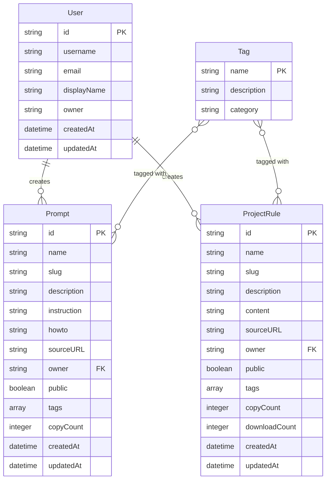
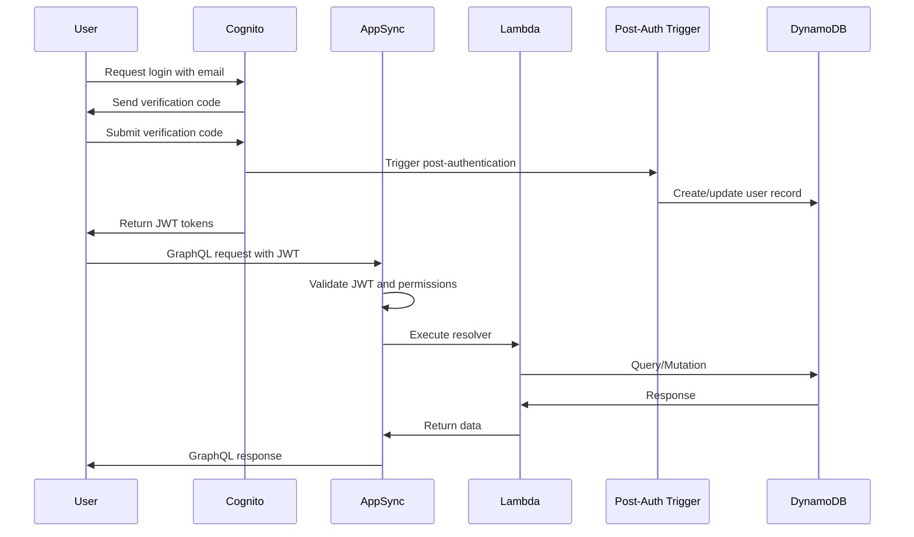
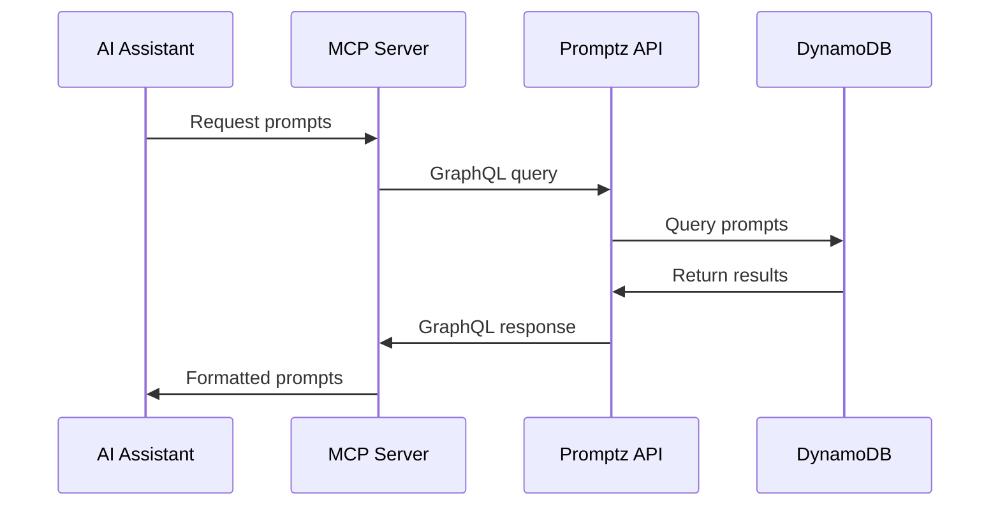

# Software Architecture

## System Architecture Overview

Promptz is built as a modern serverless web application using AWS Amplify Gen 2, providing a scalable and maintainable architecture for prompt and project rule management.

```mermaid
architecture-beta
    group frontend(cloud)[Frontend Layer]
    group auth(cloud)[Authentication Layer]
    group api(cloud)[API Layer]
    group logic(cloud)[Business Logic Layer]
    group data(cloud)[Data Layer]
    group external(cloud)[External Integrations]

    service nextjs(logos:aws-amplify)[AWS Amplify] in frontend

    service cognito(logos:aws-cognito)[Amazon Cognito] in auth
    service postauth(logos:aws-lambda)[PostAuth Triggers] in auth
    service email(logos:aws-ses)[Amazon SES] in auth

    service appsync(logos:aws-appsync)[AWS AppSync GraphQL] in api
    service resolvers(server)[Custom JS Resolvers] in logic

    service lambda(logos:aws-lambda)[CDC Functions] in data
    service dynamodb(logos:aws-dynamodb)[Amazon DynamoDB] in data
    service kinesis(logos:aws-kinesis)[Amazon DynamoDB streams] in data

    service mcp(server)[MCP Server] in external

    nextjs:R --> L:appsync
    nextjs:R --> L:cognito
    cognito:R --> L:email
    cognito:T --> L:postauth
    postauth:R --> L:dynamodb
    appsync:R --> L:resolvers
    resolvers:B --> T:dynamodb
    dynamodb:R --> L:kinesis
    lambda:T --> B:kinesis
    lambda:R --> B:dynamodb
    mcp:R --> L:appsync
```

### Architecture Components Explained

#### Frontend Layer

The **Frontend Layer** represents the client-side application built with modern web technologies:

- **AWS Amplify**: Hosts the Next.js application with automatic deployments, CDN distribution, and environment management. Amplify provides the hosting infrastructure and integrates seamlessly with the backend services.
- **Next.js App Router**: The React framework handling server-side rendering, routing, and full-stack capabilities. Uses the App Router for file-based routing and supports both client and server components.
- **React Components**: Component-based UI architecture with reusable components organized in `/components` directory, including authentication, forms, search, and content display components.
- **Tailwind CSS + shadcn/ui**: Utility-first CSS framework combined with high-quality React components built on Radix UI primitives for consistent design and accessibility.
- **Client State**: Local state management using React hooks and context providers for user authentication state, form handling, and UI interactions.

#### Authentication Layer

The **Authentication Layer** manages user identity and access control:

- **Amazon Cognito**: Provides user authentication with support for both email-based passwordless login and Google OAuth (production only). Configured with custom email templates and user attributes.
- **PostAuth Triggers**: Lambda function that executes after successful authentication to create or update user records in DynamoDB, ensuring user data consistency across the system.
- **Amazon SES**: Email service used in production for sending verification codes and authentication emails with the official `noreply@promptz.dev` address. Sandbox environments use Cognito's default email service.

#### API Layer

The **API Layer** provides the GraphQL interface for data operations:

- **AWS AppSync GraphQL**: Managed GraphQL service that handles all API requests with built-in authorization, caching, and real-time capabilities. Configured with both API key (public access) and Cognito user pool authentication.

#### Business Logic Layer

The **Business Logic Layer** contains custom javascript resolver functions to handle business logic including search functionality, data validation, and custom mutations like `savePrompt`, `copyPrompt`, and analytics tracking.

#### Data Layer

The **Data Layer** manages persistent storage and data streaming:

- **Amazon DynamoDB**: NoSQL database storing all application data with optimized access patterns. Tables include `prompt`, `projectRule`, `user`, `tag`, `promptTag`, and `ruleTag` with appropriate secondary indexes.
- **DynamoDB Streams**: Capture data changes in real-time to trigger Lambda functions for maintaining data consistency and analytics. Configured with batch processing and error handling.
- **CDC Functions**: Change Data Capture functions that process DynamoDB streams to maintain data consistency, particularly for tag relationships and analytics.
- **Tag Relations Function**: Specialized Lambda function that processes stream events from prompt and project rule tables to automatically maintain many-to-many tag relationships in join tables.

#### External Integrations

The **External Integrations** layer handles third-party services and protocols:

- **MCP Server**: Model Context Protocol server that allows AI assistants to access Promptz data directly. Provides GraphQL endpoint configuration and API key access for seamless integration with Amazon Q Developer and other AI tools.

### Key Relationships and Data Flow

1. **User Authentication Flow**: Users authenticate through Cognito → PostAuth trigger creates/updates user record → JWT tokens enable API access
2. **Content Management**: Authenticated users create prompts/rules → Custom resolvers validate and store data → Tag relations are automatically maintained via DynamoDB streams
3. **Public Access**: Anonymous users access public content via API key → AppSync serves cached responses → Search and browse functionality available without authentication
4. **MCP Integration**: AI assistants connect via MCP server → GraphQL queries retrieve relevant prompts/rules → Formatted responses enable in-context usage
5. **Analytics Tracking**: Copy/download actions trigger mutations → Analytics counters updated → Usage patterns tracked for content popularity

### Security and Authorization Model

The architecture implements a multi-layered security approach:

- **Public API Key**: Read-only access to public prompts and rules
- **Authenticated Users**: Full CRUD operations on owned content only
- **Owner-based Authorization**: Users can only modify their own content, enforced at the GraphQL resolver level
- **Backend Filtering**: Private content filtered server-side, never exposed to unauthorized clients

## Data Models and Relationships

## Key Architecture Decisions

### 1. Serverless-First Architecture

- **Decision**: Use AWS Amplify Gen 2 with serverless components
- **Rationale**: Automatic scaling, reduced operational overhead, cost-effective for variable workloads
- **Trade-offs**: Vendor lock-in, cold start latency, limited customization options

### 2. GraphQL API with AppSync

- **Decision**: Use AWS AppSync for GraphQL API instead of REST
- **Rationale**: Type-safe queries, real-time subscriptions, built-in authorization
- **Trade-offs**: Learning curve, AWS-specific implementation, limited offline capabilities

### 3. Tag-Based Many-to-Many Relationships

- **Decision**: Implement dedicated tag models with join tables
- **Rationale**: Better query performance, enhanced discoverability, SEO benefits
- **Trade-offs**: Increased complexity, data migration requirements

### 4. Passwordless Authentication

- **Decision**: Use Amazon Cognito with email-based passwordless login
- **Rationale**: Improved user experience, reduced security risks, lower friction
- **Trade-offs**: Email dependency, potential delivery issues, limited customization

## Security Architecture

### Authentication and Authorization

### Authorization Levels

1. **Public Access**: Read-only access to public prompts and rules via API key
2. **Authenticated Users**: Full CRUD operations on owned content
3. **Owner-based Access**: Users can only modify their own content
4. **Admin Access**: AWS Console access for system administration

### Privacy and Data Protection

- **Minimal Data Collection**: Only essential data (email for authentication) is collected
- **Custom Resolvers**: Prevent exposure of private data through API design
- **GDPR Compliance**: Data privacy considerations built into architecture
- **Backend Filtering**: Private prompts filtered at API level, not exposed to clients

## Performance Considerations

### Database Design

- **Single Table Design**: Optimized for DynamoDB access patterns
- **Secondary Indexes**: GSI for slug-based queries and name-based searches
- **Composite Keys**: Efficient querying for tag relationships
- **Scan Prevention**: All data fetching relies on primary keys, primary/sort keys, or secondary indices to avoid expensive scan operations

### Caching Strategy

- **CDN Caching**: Static assets cached via AWS CloudFront
- **API Caching**: AppSync caching for frequently accessed data
- **Client-side Caching**: React Query for client-side data management

### Search Optimization

- **Custom Search Resolvers**: Optimized search functionality for prompts and rules
- **Tag-based Filtering**: Efficient filtering using tag relationships
- **Pagination**: Cursor-based pagination for large result sets
- **Known Limitations**: Current search implementation lacks pagination and caching, limiting scalability beyond 20,000 requests per day

## Integration Architecture

### MCP Server Integration

### SEO and Discoverability

- **Dynamic Sitemap Generation**: Automated sitemap.xml creation
- **Slug-based URLs**: SEO-friendly URLs for all content
- **OpenGraph Integration**: Social media sharing optimization
- **Structured Data**: Schema.org markup for search engines

## Deployment Architecture

### Environment Configuration

- **Sandbox Environment**: Development and testing with relaxed security
- **Production Environment**: Full security, monitoring, and backup enabled
- **Environment Variables**: Configuration through PROMPTZ_ENV variable

### Infrastructure as Code

- **Amplify Backend**: Declarative infrastructure definition
- **CDK Integration**: Custom resources using AWS CDK
- **Automated Deployment**: CI/CD pipeline through Amplify Console

### Development Workflow

1. **Feature Development**: Implement features using Amplify sandbox environment
2. **Local Testing**: Automated and manual testing using unit tests and E2E tests on localhost
3. **Main Branch**: Merge changes to main branch
4. **Staging Deployment**: Automatic deployment to staging environment via GitHub Actions
5. **Staging Testing**: Run E2E tests against staging environment
6. **Production Deployment**: Merge main to prod branch for automatic production deployment
7. **Production Monitoring**: Manual monitoring of production environment

### Data Migration Strategy

- **Migration Scripts**: Developer-executed scripts for schema changes
- **Backward Compatibility**: Essential for schema evolution
- **Data Protection**: DynamoDB tables configured with deletion protection and PITR
- **Staged Rollouts**: Changes tested on staging before production deployment

## Monitoring and Observability

### Application Monitoring

- **AWS CloudWatch**: Application logs and metrics
- **AWS X-Ray**: Distributed tracing (production only)
- **Custom Metrics**: Business metrics tracking

### Error Handling

- **Graceful Degradation**: Fallback mechanisms for service failures
- **Error Boundaries**: React error boundaries for UI resilience
- **Retry Logic**: Automatic retry for transient failures

### Current Limitations

- **No Automated Alerts**: No specific monitoring alerts or operational runbooks for production issues
- **Manual Monitoring**: Production environment requires manual monitoring
- **No Feature Flags**: No mechanism for feature flags or gradual rollouts
- **No Rate Limiting**: No rate limiting or usage quotas implemented for public API
- **No API Versioning**: No explicit versioning implemented for GraphQL API

## Scalability Considerations

### Horizontal Scaling

- **Serverless Auto-scaling**: Automatic scaling based on demand
- **DynamoDB On-Demand**: Automatic capacity management
- **CDN Distribution**: Global content distribution

### Performance Optimization

- **Code Splitting**: Lazy loading of React components
- **Image Optimization**: Next.js automatic image optimization
- **Bundle Optimization**: Tree shaking and minification
