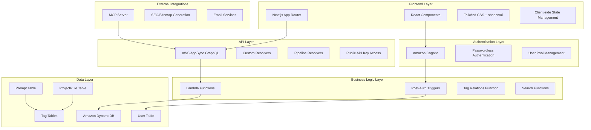
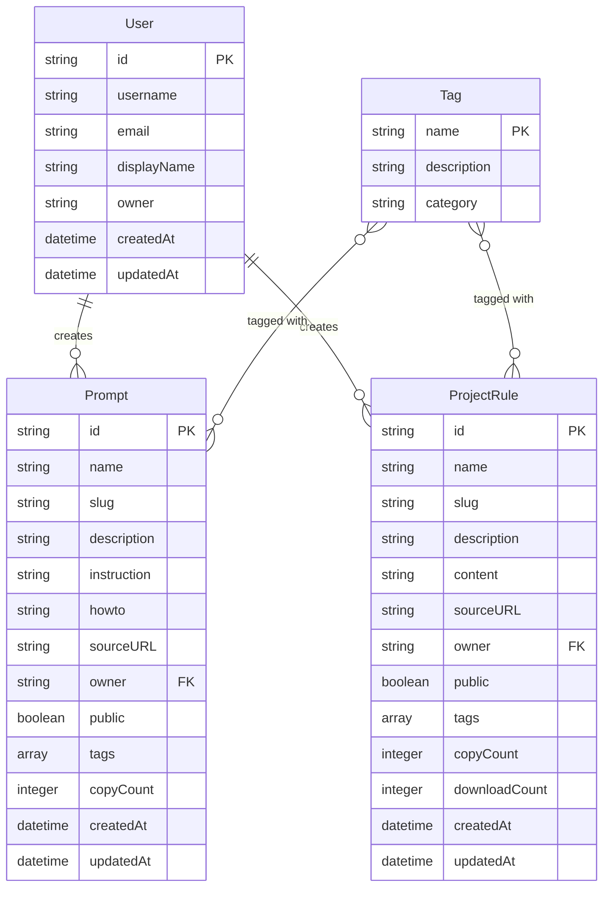
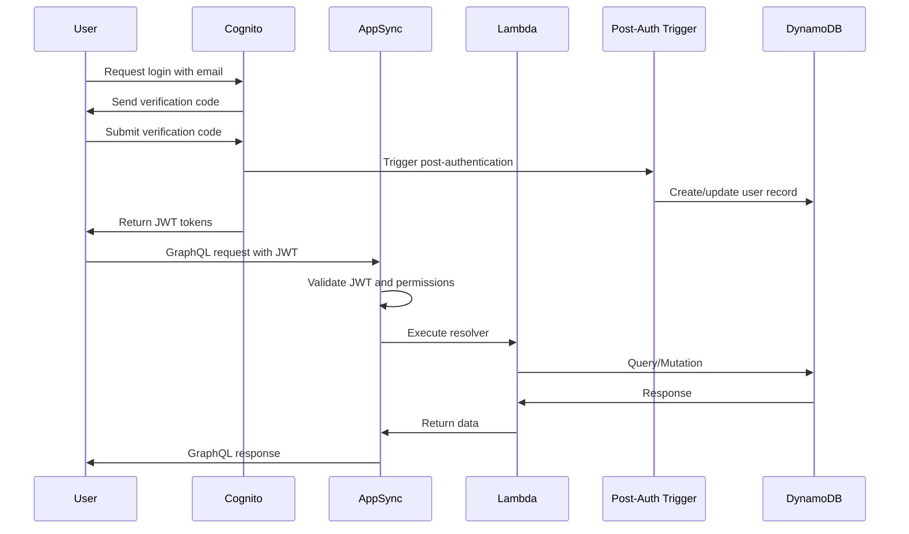
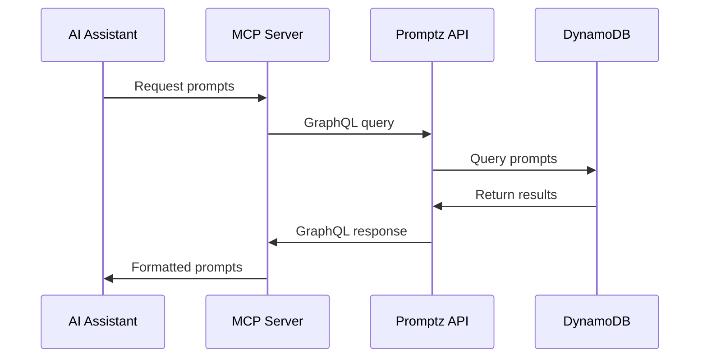

# Software Architecture

## System Architecture Overview

Promptz is built as a modern serverless web application using AWS Amplify Gen 2, providing a scalable and maintainable architecture for prompt and project rule management.

## Data Models and Relationships

## Key Architecture Decisions

### 1. Serverless-First Architecture

- **Decision**: Use AWS Amplify Gen 2 with serverless components
- **Rationale**: Automatic scaling, reduced operational overhead, cost-effective for variable workloads
- **Trade-offs**: Vendor lock-in, cold start latency, limited customization options

### 2. GraphQL API with AppSync

- **Decision**: Use AWS AppSync for GraphQL API instead of REST
- **Rationale**: Type-safe queries, real-time subscriptions, built-in authorization
- **Trade-offs**: Learning curve, AWS-specific implementation, limited offline capabilities

### 3. Tag-Based Many-to-Many Relationships

- **Decision**: Implement dedicated tag models with join tables
- **Rationale**: Better query performance, enhanced discoverability, SEO benefits
- **Trade-offs**: Increased complexity, data migration requirements

### 4. Passwordless Authentication

- **Decision**: Use Amazon Cognito with email-based passwordless login
- **Rationale**: Improved user experience, reduced security risks, lower friction
- **Trade-offs**: Email dependency, potential delivery issues, limited customization

## Security Architecture

### Authentication and Authorization

### Authorization Levels

1. **Public Access**: Read-only access to public prompts and rules via API key
2. **Authenticated Users**: Full CRUD operations on owned content
3. **Owner-based Access**: Users can only modify their own content
4. **Admin Access**: AWS Console access for system administration

### Privacy and Data Protection

- **Minimal Data Collection**: Only essential data (email for authentication) is collected
- **Custom Resolvers**: Prevent exposure of private data through API design
- **GDPR Compliance**: Data privacy considerations built into architecture
- **Backend Filtering**: Private prompts filtered at API level, not exposed to clients

## Performance Considerations

### Database Design

- **Single Table Design**: Optimized for DynamoDB access patterns
- **Secondary Indexes**: GSI for slug-based queries and name-based searches
- **Composite Keys**: Efficient querying for tag relationships
- **Scan Prevention**: All data fetching relies on primary keys, primary/sort keys, or secondary indices to avoid expensive scan operations

### Caching Strategy

- **CDN Caching**: Static assets cached via AWS CloudFront
- **API Caching**: AppSync caching for frequently accessed data
- **Client-side Caching**: React Query for client-side data management

### Search Optimization

- **Custom Search Resolvers**: Optimized search functionality for prompts and rules
- **Tag-based Filtering**: Efficient filtering using tag relationships
- **Pagination**: Cursor-based pagination for large result sets
- **Known Limitations**: Current search implementation lacks pagination and caching, limiting scalability beyond 20,000 requests per day

## Integration Architecture

### MCP Server Integration

### SEO and Discoverability

- **Dynamic Sitemap Generation**: Automated sitemap.xml creation
- **Slug-based URLs**: SEO-friendly URLs for all content
- **OpenGraph Integration**: Social media sharing optimization
- **Structured Data**: Schema.org markup for search engines

## Deployment Architecture

### Environment Configuration

- **Sandbox Environment**: Development and testing with relaxed security
- **Production Environment**: Full security, monitoring, and backup enabled
- **Environment Variables**: Configuration through PROMPTZ_ENV variable

### Infrastructure as Code

- **Amplify Backend**: Declarative infrastructure definition
- **CDK Integration**: Custom resources using AWS CDK
- **Automated Deployment**: CI/CD pipeline through Amplify Console

### Development Workflow

1. **Feature Development**: Implement features using Amplify sandbox environment
2. **Local Testing**: Automated and manual testing using unit tests and E2E tests on localhost
3. **Main Branch**: Merge changes to main branch
4. **Staging Deployment**: Automatic deployment to staging environment via GitHub Actions
5. **Staging Testing**: Run E2E tests against staging environment
6. **Production Deployment**: Merge main to prod branch for automatic production deployment
7. **Production Monitoring**: Manual monitoring of production environment

### Data Migration Strategy

- **Migration Scripts**: Developer-executed scripts for schema changes
- **Backward Compatibility**: Essential for schema evolution
- **Data Protection**: DynamoDB tables configured with deletion protection and PITR
- **Staged Rollouts**: Changes tested on staging before production deployment

## Monitoring and Observability

### Application Monitoring

- **AWS CloudWatch**: Application logs and metrics
- **AWS X-Ray**: Distributed tracing (production only)
- **Custom Metrics**: Business metrics tracking

### Error Handling

- **Graceful Degradation**: Fallback mechanisms for service failures
- **Error Boundaries**: React error boundaries for UI resilience
- **Retry Logic**: Automatic retry for transient failures

### Current Limitations

- **No Automated Alerts**: No specific monitoring alerts or operational runbooks for production issues
- **Manual Monitoring**: Production environment requires manual monitoring
- **No Feature Flags**: No mechanism for feature flags or gradual rollouts
- **No Rate Limiting**: No rate limiting or usage quotas implemented for public API
- **No API Versioning**: No explicit versioning implemented for GraphQL API

## Scalability Considerations

### Horizontal Scaling

- **Serverless Auto-scaling**: Automatic scaling based on demand
- **DynamoDB On-Demand**: Automatic capacity management
- **CDN Distribution**: Global content distribution

### Performance Optimization

- **Code Splitting**: Lazy loading of React components
- **Image Optimization**: Next.js automatic image optimization
- **Bundle Optimization**: Tree shaking and minification
