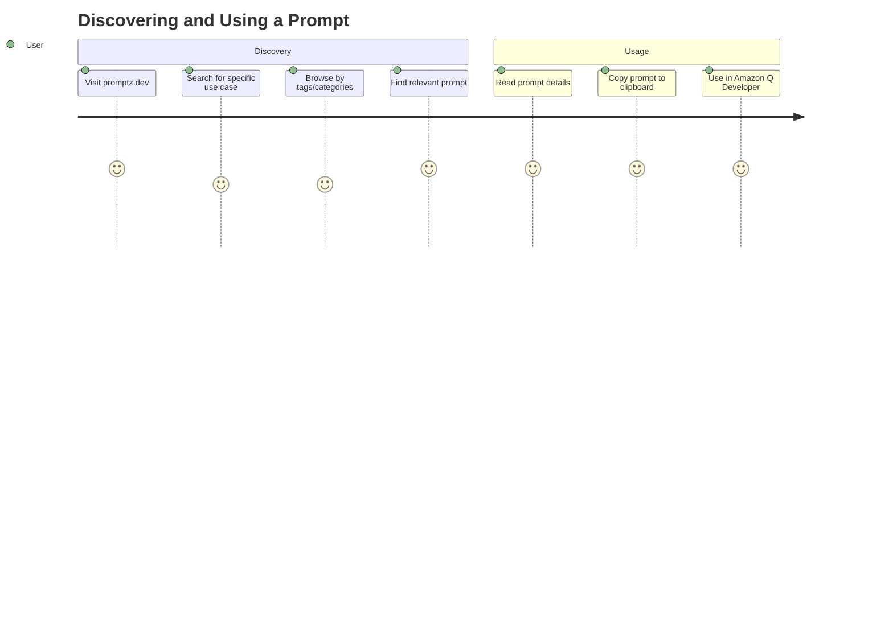

# Project Overview

## Product Vision

Promptz is the ultimate prompting hub for Amazon Q Developer, designed to help developers discover, create, and perfect their prompts for every step of the software development lifecycle. The platform serves as a centralized repository where developers can share, discover, and collaborate on high-quality prompts and project rules specifically tailored for Amazon Q Developer.

## Core Mission

Simplify collaboration with Amazon Q Developer by providing a comprehensive, community-driven platform that reduces friction in developer workflows and enhances productivity through effective AI-assisted development. Promptz aims to become the one-stop shop for all Q Developer capabilities including prompts, project rules, context hooks, and future capabilities that help developers be more efficient.

## Strategic Focus

- **100% Amazon Q Developer Focus**: Exclusively dedicated to Amazon Q Developer capabilities and ecosystem
- **Open Source & Free**: Committed to remaining open-source and free to use forever
- **Community-Driven**: Encouraging collaborative improvement and knowledge sharing
- **Quality Through Usage**: Promoting iterative improvement through community feedback and usage analytics

## Target Users

### Primary Users

- **Software Developers** using Amazon Q Developer in their daily workflow
- **Development Teams** looking to standardize prompting practices
- **DevOps Engineers** seeking automation and deployment prompts
- **Technical Leaders** establishing coding standards and best practices

### Secondary Users

- **AWS Community Builders and AWS Heroes** sharing expertise and best practices
- **Technical Content Creators** documenting and sharing prompt engineering knowledge
- **Enterprise Development Teams** implementing consistent AI-assisted development practices

## Community and Content Quality

### Content Submission

- **Authentication Required**: Only authenticated users can submit prompts and project rules
- **Quality Philosophy**: Encouraging learning and iterative improvement over strict quality gates
- **Community Feedback**: Usage analytics (copy/download counts) provide indirect feedback on content quality
- **No Moderation Policies**: Currently no formal content moderation policies in place

### User Feedback Mechanisms

- **Primary Channel**: GitHub issues for bug reports and feature requests
- **Usage Analytics**: Aggregated copy and download interactions tracked per prompt/rule
- **Indirect Feedback**: Community usage patterns indicate content effectiveness
- **Future Considerations**: Direct feedback mechanisms (comments, ratings) under consideration

### Spam Prevention

- **Authentication Barrier**: Requiring user authentication serves as primary spam prevention
- **Community Self-Regulation**: Reliance on community usage patterns to surface quality content

## User Problems Solved

### Context Switching Reduction

- **Solution**: Direct integration through MCP server allows in-context prompt access

### Prompt Quality Issues

- **Problem**: Developers struggle with ineffective prompts leading to poor AI responses
- **Solution**: Curated, community-tested prompts with proven effectiveness

### Knowledge Fragmentation

- **Problem**: Best practices scattered across blogs, social media, and documentation
- **Solution**: Centralized repository with proper attribution and organization

### Team Consistency

- **Problem**: Teams lack standardized approaches to AI-assisted development
- **Solution**: Shared project rules and team-specific prompt collections

## User Journeys

## Current Development State

### Recently Completed Features

- **Tag-Based Discoverability** (Issue #93): Enhanced tag system with many-to-many relationships
- **Project Rules Support** (Issue #86): Complete implementation of Amazon Q project rules
- **SEO Improvements** (Issue #85): Slug-based URLs and sitemap generation
- **MCP Server Integration** (Issue #84): Model Context Protocol server for AI assistant integration
- **User Management System**: Authentication and user profile management
- **Prompt Analytics**: Copy count and popularity tracking

### Active Development (Open Issues)

- **Token Calculation** (Issue #102): Implement approximate token counting for prompts and rules
- **Context Hooks Support** (Issue #101): Add support for Amazon Q CLI context hooks
- **MCP Server Listings** (Issue #100): Curated catalog of compatible MCP servers
- **UI/UX Improvements** (Issue #98): Better visibility controls and user guidance
- **GitHub Integration** (Issue #88): Collaborative updates through GitHub Actions

### Technical Debt and Improvements

- Enhanced search functionality optimization
- Performance improvements for large content libraries
- Mobile responsiveness enhancements
- Accessibility compliance improvements

## Success Metrics

### Primary KPIs

- **Content Creation**: Number of prompts and project rules submitted to the platform
- **Daily Traffic**: Total number of requests per day on promptz.dev (current baseline: <20,000/day)
- **Content Usage**: Prompt and project rule usage derived from copy and download interactions
- **SEO Performance**: SEO impressions, clicks, and search rankings (measured via Google Search Console)

### Secondary Metrics

- **User Engagement**: Monthly active users and user retention rates
- **Content Quality**: Community-driven quality through usage analytics
- **Platform Growth**: Total prompts and rules in library
- **Integration Adoption**: MCP server usage and API access patterns

## Future Roadmap

### Short-term (Next 3 months)

- Complete token calculation feature (Issue #102)
- Implement context hooks support (Issue #101)
- Enhance MCP server catalog (Issue #100)

### Long-term (6+ months)

- Enhanced MCP server capabilities and features
- Advanced personalization features
- Multi-language support
- Additional Amazon Q Developer capability integrations
