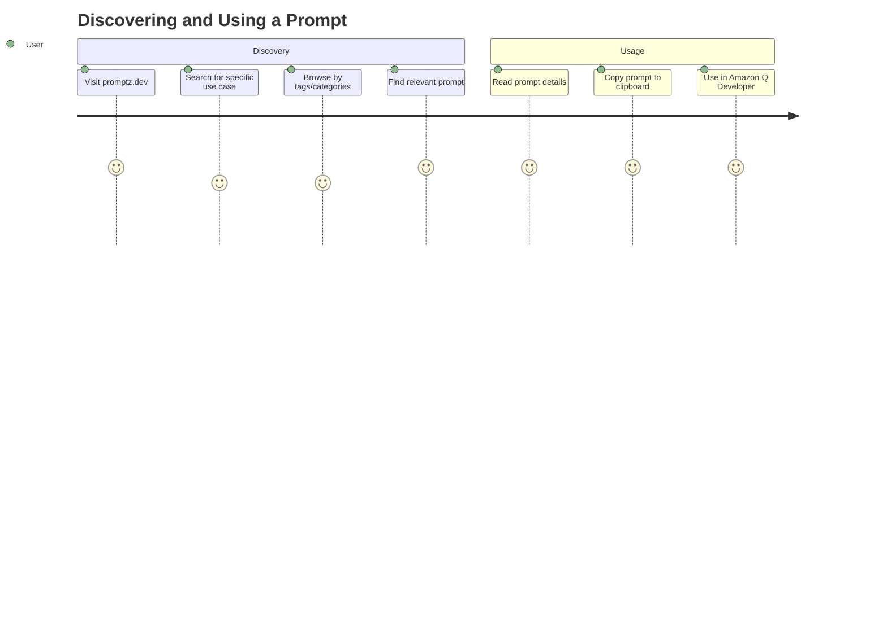
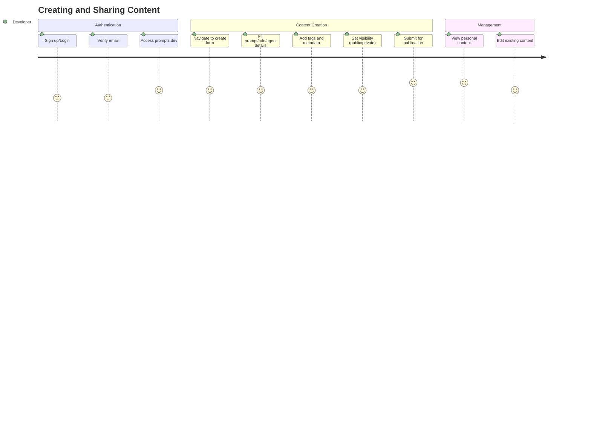
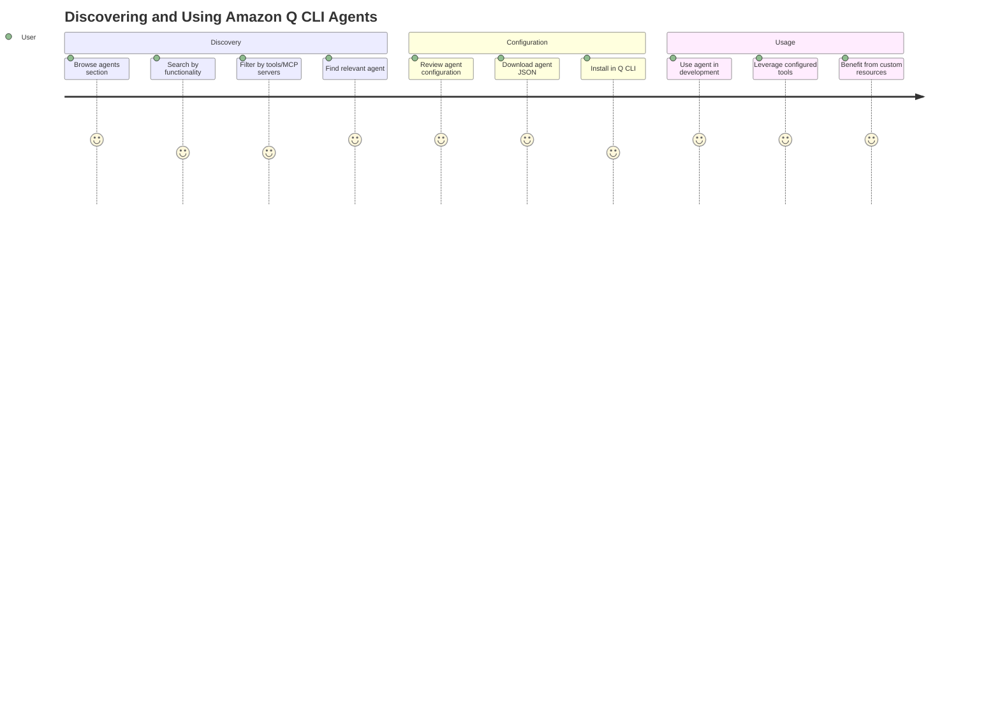

# Project Overview

## Product Vision

Promptz is the ultimate library for Amazon Q Developer, designed to help developers discover, create, and perfect their prompts, project rules, and custom agents for every step of the software development lifecycle. The platform serves as a centralized repository where developers can share, discover, and collaborate on high-quality prompts, project rules, and Amazon Q CLI agents specifically tailored for Amazon Q Developer.

## Core Mission

Simplify collaboration with Amazon Q Developer by providing a comprehensive, community-driven platform that reduces friction in developer workflows and enhances productivity through effective AI-assisted development. Promptz aims to become the one-stop shop for all Q Developer capabilities including prompts, project rules, context hooks, and future capabilities that help developers be more efficient.

## Strategic Focus

- **100% Amazon Q Developer Focus**: Exclusively dedicated to Amazon Q Developer capabilities and ecosystem
- **Open Source & Free**: Committed to remaining open-source and free to use forever
- **Community-Driven**: Encouraging collaborative improvement and knowledge sharing
- **Quality Through Usage**: Promoting iterative improvement through community feedback and usage analytics

## Target Users

### Primary Users

- **Software Developers** using Amazon Q Developer in their daily workflow
- **Development Teams** looking to standardize prompting practices
- **DevOps Engineers** seeking automation and deployment prompts
- **Technical Leaders** establishing coding standards and best practices

### Secondary Users

- **AWS Community Builders and AWS Heroes** sharing expertise and best practices
- **Technical Content Creators** documenting and sharing prompt engineering knowledge
- **Enterprise Development Teams** implementing consistent AI-assisted development practices

## User Problems Solved

### Prompt Quality Issues

- **Problem**: Developers struggle with ineffective prompts leading to poor AI responses
- **Solution**: Curated, community-tested prompts with proven effectiveness

### Knowledge Fragmentation

- **Problem**: Best practices scattered across blogs, social media, and documentation
- **Solution**: Centralized repository with proper attribution and organization

### Team Consistency

- **Problem**: Teams lack standardized approaches to AI-assisted development
- **Solution**: Shared project rules and team-specific prompt collections

## User Journeys

## Success Metrics

### Primary KPIs

- **Content Creation**: Number of prompts and project rules submitted to the platform
- **Daily Traffic**: Total number of requests per day on promptz.dev (current baseline: <20,000/day)
- **Content Usage**: Prompt and project rule usage derived from copy and download interactions
- **SEO Performance**: SEO impressions, clicks, and search rankings (measured via Google Search Console)

### Secondary Metrics

- **User Engagement**: Monthly active users and user retention rates
- **Content Quality**: Community-driven quality through usage analytics
- **Platform Growth**: Total prompts and rules in library
- **Integration Adoption**: MCP server usage and API access patterns
