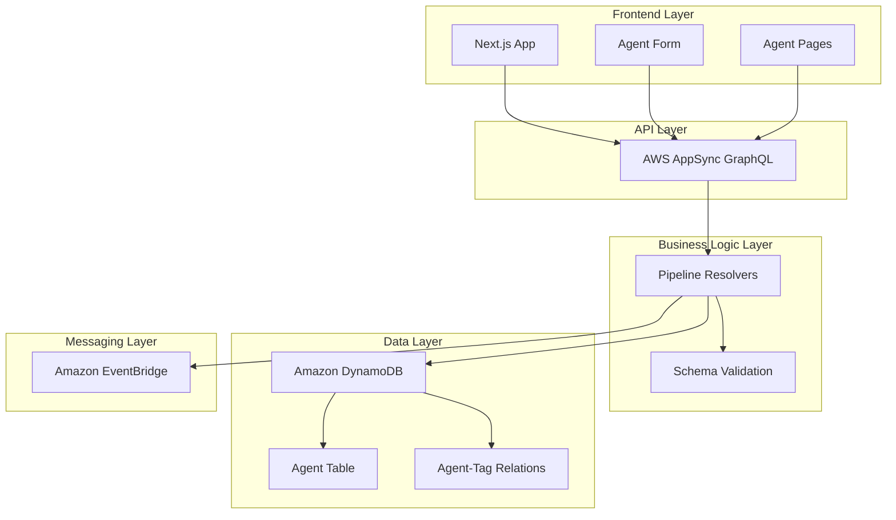
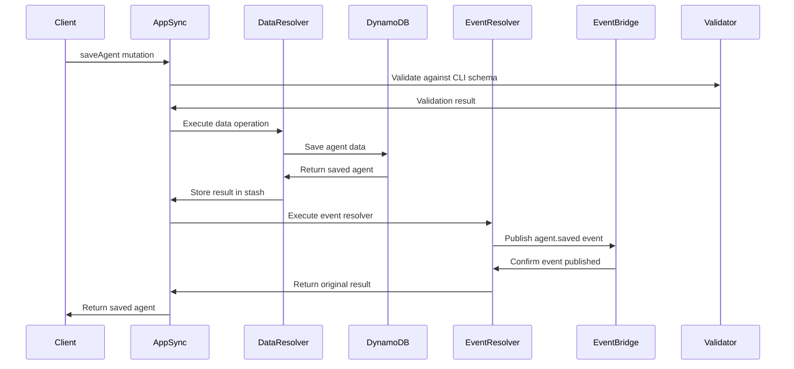
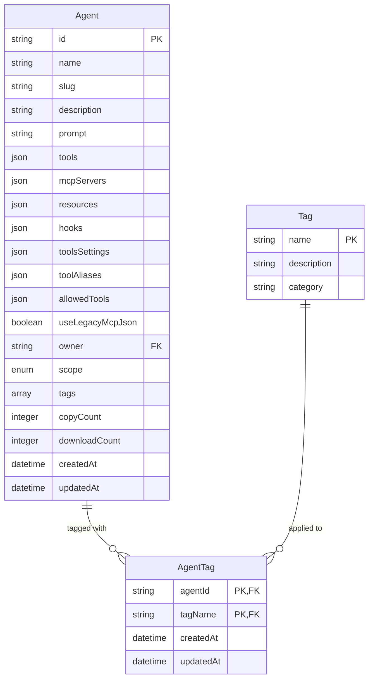

# Design: Amazon Q Developer CLI Custom Agents Support

## System Architecture Overview

The Amazon Q Developer CLI Custom Agents feature extends the existing Promptz architecture by adding a new content type alongside prompts and project rules. The design follows established patterns while accommodating the more complex configuration requirements of CLI agents.



## Data Model Design

### Agent Entity Model

The Agent model extends the common content attributes pattern established by prompts and project rules:

```typescript
interface Agent {
  // Common attributes (inherited from commonContentAttributes)
  id: string;
  name: string;
  slug: string;
  description: string;
  sourceURL?: string;
  howto?: string;
  scope: "PRIVATE" | "PUBLIC";
  tags: string[];
  owner: string;
  copyCount: number;
  downloadCount: number;
  createdAt: string;
  updatedAt: string;

  // Agent-specific attributes
  prompt?: string; // System prompt for the agent
  tools: string[]; // Available tools array
  mcpServers: Record<string, McpServerConfig>; // MCP server configurations
  resources: string[]; // Resource file paths
  hooks: Record<string, HookCommand[]>; // Lifecycle hooks
  toolsSettings: Record<string, any>; // Tool-specific settings
  toolAliases: Record<string, string>; // Tool name aliases
  allowedTools: string[]; // Explicitly allowed tools
  useLegacyMcpJson: boolean; // Legacy MCP support flag
}

interface McpServerConfig {
  command: string;
  args?: string[];
  env?: Record<string, string>;
  timeout?: number;
  disabled?: boolean;
}

interface HookCommand {
  command: string;
}
```

### Database Schema Design

Following the existing DynamoDB single-table design pattern:

```typescript
// Primary Agent Table
const agentTable = {
  TableName: "Agent",
  PartitionKey: "id",
  SortKey: null,
  GlobalSecondaryIndexes: [
    {
      IndexName: "slugIndex",
      PartitionKey: "slug",
      ProjectionType: "ALL",
    },
    {
      IndexName: "nameIndex",
      PartitionKey: "name",
      ProjectionType: "ALL",
    },
    {
      IndexName: "scopeIndex",
      PartitionKey: "scope",
      ProjectionType: "ALL",
    },
    {
      IndexName: "ownerIndex",
      PartitionKey: "owner",
      ProjectionType: "ALL",
    },
  ],
};

// Agent-Tag Relationship Table
const agentTagTable = {
  TableName: "AgentTag",
  PartitionKey: "agentId",
  SortKey: "tagName",
  GlobalSecondaryIndexes: [
    {
      IndexName: "tagIndex",
      PartitionKey: "tagName",
      SortKey: "agentId",
      ProjectionType: "ALL",
    },
  ],
};
```

## API Design

### GraphQL Schema Extensions

```graphql
type Agent {
  id: ID!
  name: String!
  slug: String!
  description: String!
  prompt: String
  tools: [String!]!
  mcpServers: AWSJSON
  resources: [String!]!
  hooks: AWSJSON
  toolsSettings: AWSJSON
  toolAliases: AWSJSON
  allowedTools: [String!]!
  useLegacyMcpJson: Boolean!
  sourceURL: String
  howto: String
  scope: Scope!
  tags: [String!]!
  owner: String!
  author: User
  linkedTags: [AgentTag!]!
  copyCount: Int!
  downloadCount: Int!
  createdAt: AWSDateTime!
  updatedAt: AWSDateTime!
}

type AgentTag {
  agentId: ID!
  tagName: String!
  agent: Agent!
  tag: Tag!
  createdAt: AWSDateTime!
  updatedAt: AWSDateTime!
}

input AgentInput {
  name: String!
  description: String!
  prompt: String
  tools: [String!]!
  mcpServers: AWSJSON
  resources: [String!]!
  hooks: AWSJSON
  toolsSettings: AWSJSON
  toolAliases: AWSJSON
  allowedTools: [String!]!
  useLegacyMcpJson: Boolean
  sourceURL: String
  howto: String
  scope: Scope!
  tags: [String!]!
}

type Mutation {
  saveAgent(input: AgentInput!): Agent
  deleteAgent(id: ID!): Agent
  copyAgent(id: ID!): Agent
  downloadAgent(id: ID!): Agent
}

type Query {
  getAgent(id: ID!): Agent
  getAgentBySlug(slug: String!): Agent
  listAgentsByTag(tagName: String!): [Agent!]!
  searchAgents(query: String!, tags: [String!]): [Agent!]!
}
```

### Pipeline Resolver Architecture

Following the established pattern of two-step pipeline resolvers:



## User Interface Design

### Navigation Integration

The agents feature integrates into the existing navigation structure:

```
Header Navigation:
├── Prompts
├── Rules
├── Agents (NEW)
└── MCP Server

Agent Section Structure:
├── /agents (Browse all public agents)
├── /agents/create (Create new agent)
├── /agents/my (User's private agents)
├── /agents/agent/[slug] (Agent detail page)
└── /agents/tag/[tagName] (Tag-filtered agents)
```

### Agent Creation Form Design

The agent creation form follows the established pattern but accommodates the complex agent configuration:

```mermaid
graph TD
    A[Agent Form] --> B[Basic Information]
    A --> C[Agent Configuration]
    A --> D[Tools & MCP Servers]
    A --> E[Resources & Hooks]
    A --> F[Metadata & Tags]

    B --> B1[Name]
    B --> B2[Description]
    B --> B3[System Prompt]

    C --> C1[Tool Selection]
    C --> C2[Tool Aliases]
    C --> C3[Allowed Tools]
    C --> C4[Legacy MCP Support]

    D --> D1[MCP Server Config]
    D --> D2[Server Commands]
    D --> D3[Environment Variables]
    D --> D4[Timeouts & Settings]

    E --> E1[Resource Files]
    E --> E2[Promptz References]
    E --> E3[Lifecycle Hooks]
    E --> E4[Tool Settings]

    F --> F1[Tags]
    F --> F2[Visibility]
    F --> F3[Source URL]
    F --> F4[How-to Guide]
```



### Form Component Architecture

```typescript
interface AgentFormProps {
  agent?: Agent;
  onSubmit: (data: AgentFormData) => Promise<void>;
  onCancel: () => void;
}

interface AgentFormData {
  basicInfo: {
    name: string;
    description: string;
    prompt?: string;
  };
  toolsConfig: {
    tools: string[];
    toolAliases: Record<string, string>;
    allowedTools: string[];
    useLegacyMcpJson: boolean;
  };
  mcpServers: Record<string, McpServerConfig>;
  resources: string[];
  hooks: Record<string, HookCommand[]>;
  toolsSettings: Record<string, any>;
  metadata: {
    tags: string[];
    scope: "PRIVATE" | "PUBLIC";
    sourceURL?: string;
    howto?: string;
  };
}
```

## Validation and Schema Compliance

### Client-Side Validation

Using Zod schema validation following the established pattern:

```typescript
const agentFormSchema = z.object({
  name: z.string().min(1, "Name is required").max(100),
  description: z.string().min(1, "Description is required").max(500),
  prompt: z.string().optional(),
  tools: z.array(z.string()).default([]),
  mcpServers: z
    .record(
      z.object({
        command: z.string().min(1, "Command is required"),
        args: z.array(z.string()).optional(),
        env: z.record(z.string()).optional(),
        timeout: z.number().min(0).optional(),
        disabled: z.boolean().optional(),
      }),
    )
    .default({}),
  resources: z
    .array(z.string().regex(/^file:\/\//, "Resources must start with file://"))
    .default([]),
  hooks: z
    .record(
      z.array(
        z.object({
          command: z.string().min(1, "Hook command is required"),
        }),
      ),
    )
    .default({}),
  toolsSettings: z.record(z.any()).default({}),
  toolAliases: z.record(z.string()).default({}),
  allowedTools: z.array(z.string()).default([]),
  useLegacyMcpJson: z.boolean().default(false),
  scope: z.enum(["PRIVATE", "PUBLIC"]),
  tags: z.array(z.string()).max(10, "Maximum 10 tags allowed"),
  sourceURL: z.string().url().optional().or(z.literal("")),
  howto: z.string().optional(),
});
```

### Server-Side Schema Validation

Pipeline resolver validation against the official Amazon Q CLI agent schema:

```javascript
// Custom resolver: validateAgentSchema.js
export function request(ctx) {
  const agentData = ctx.args.input;

  // Transform to CLI agent format
  const cliAgent = {
    name: agentData.name,
    description: agentData.description,
    prompt: agentData.prompt,
    tools: agentData.tools,
    mcpServers: agentData.mcpServers,
    resources: agentData.resources,
    hooks: agentData.hooks,
    toolsSettings: agentData.toolsSettings,
    toolAliases: agentData.toolAliases,
    allowedTools: agentData.allowedTools,
    useLegacyMcpJson: agentData.useLegacyMcpJson,
  };

  // Validate against official schema
  const validation = validateAgainstCliSchema(cliAgent);

  if (!validation.valid) {
    util.error(
      "Agent configuration validation failed",
      "ValidationError",
      validation.errors,
    );
  }

  return {
    operation: "Invoke",
    payload: {
      ...ctx,
      validatedAgent: cliAgent,
    },
  };
}
```

## Integration Points

### Tag System Integration

Agents integrate with the existing tag system through the established many-to-many relationship pattern:



### Search Integration

Agents use the existing search.js resolver used for prompts and project rules.

### EventBridge Integration

Agents follow the established event publishing patterns from prompts and project rules.

## Security and Authorization

### Access Control Design

Agents follow the established authorization pattern used for prompts and project rules.

```typescript
// AppSync caching configuration
const agentResolverCaching = {
  cachingConfig: {
    ttl: 300, // 5 minutes for agent listings
    cachingKeys: ["$context.args.tags", "$context.args.scope"],
  },
};

// Individual agent caching
const agentDetailCaching = {
  cachingConfig: {
    ttl: 900, // 15 minutes for agent details
    cachingKeys: ["$context.args.slug"],
  },
};
```

## Monitoring and Observability

### Metrics and Logging

```typescript
// Custom metrics for agent operations
const agentMetrics = {
  "agent.created": { unit: "Count", value: 1 },
  "agent.downloaded": { unit: "Count", value: 1 },
  "agent.validation.failed": { unit: "Count", value: 1 },
  "agent.search.duration": { unit: "Milliseconds", value: duration },
};

// Structured logging
const agentLogger = {
  info: (message: string, context: any) => {
    console.log(
      JSON.stringify({
        level: "INFO",
        message,
        context,
        timestamp: new Date().toISOString(),
        service: "agent-service",
      }),
    );
  },
};
```

### Health Checks

```typescript
// Agent service health check
async function checkAgentServiceHealth(): Promise<HealthStatus> {
  try {
    // Test basic agent operations
    await testAgentQuery();
    await testSchemaValidation();

    return { status: "healthy", timestamp: new Date().toISOString() };
  } catch (error) {
    return {
      status: "unhealthy",
      error: error.message,
      timestamp: new Date().toISOString(),
    };
  }
}
```

This design provides a comprehensive foundation for implementing Amazon Q Developer CLI Custom Agents support while maintaining consistency with existing Promptz architecture patterns and ensuring scalability, security, and maintainability.
