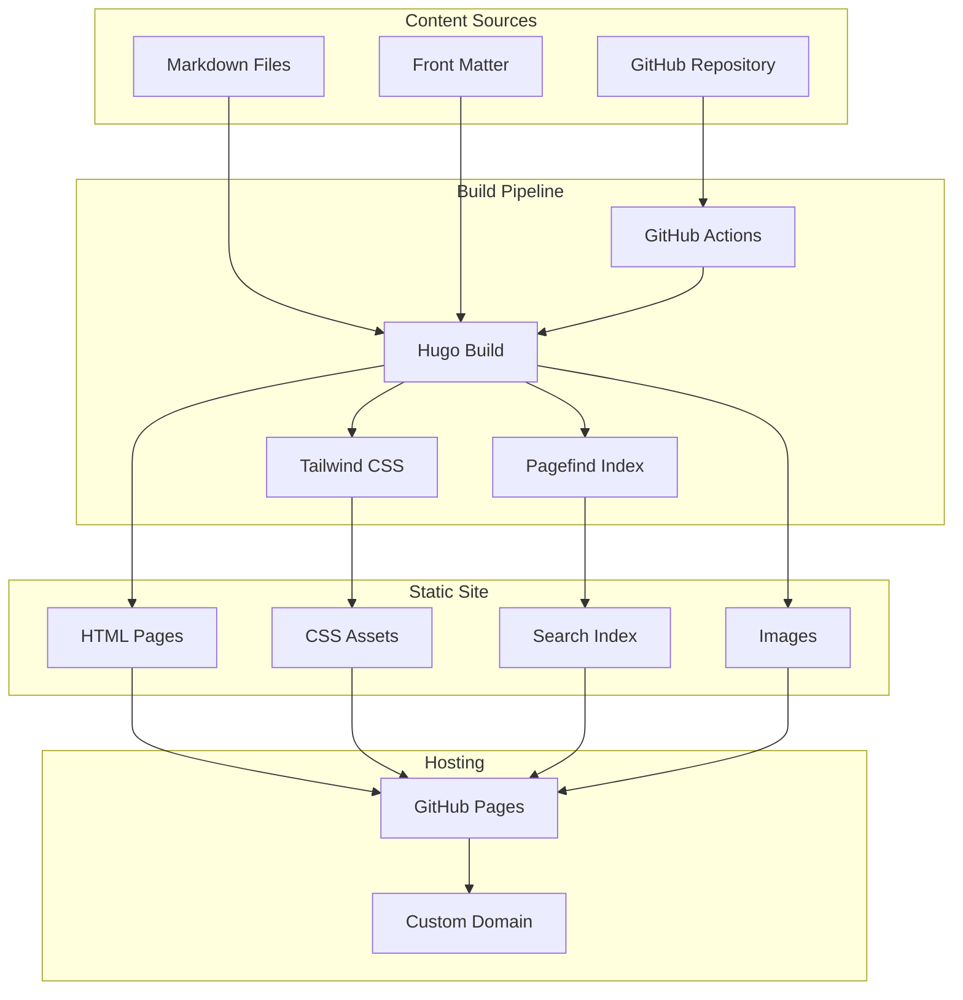
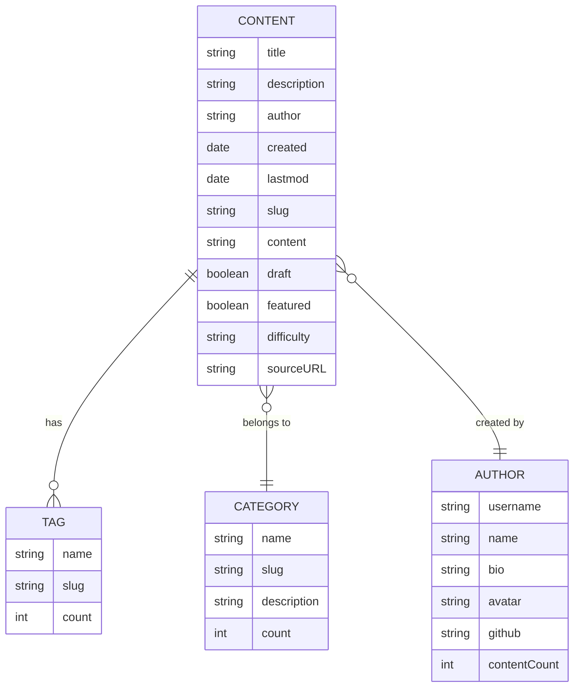
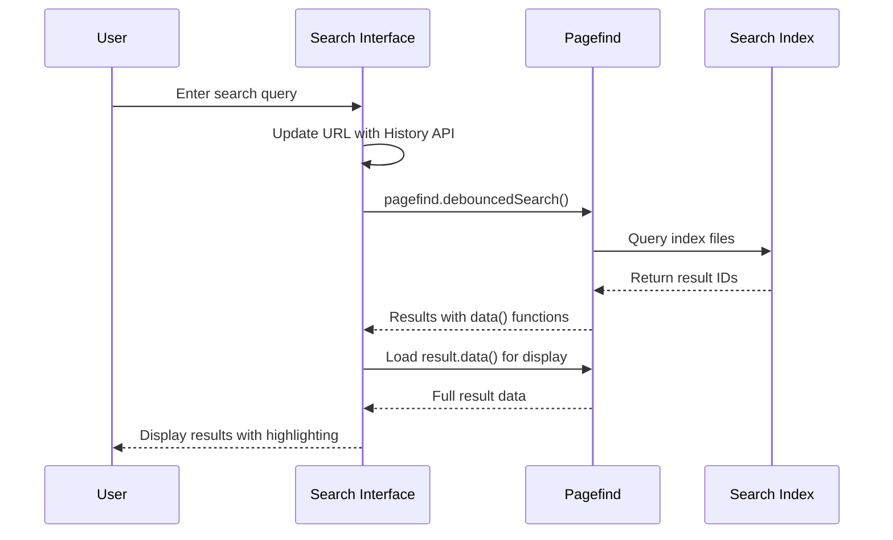
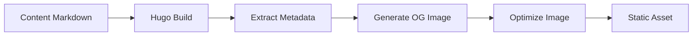
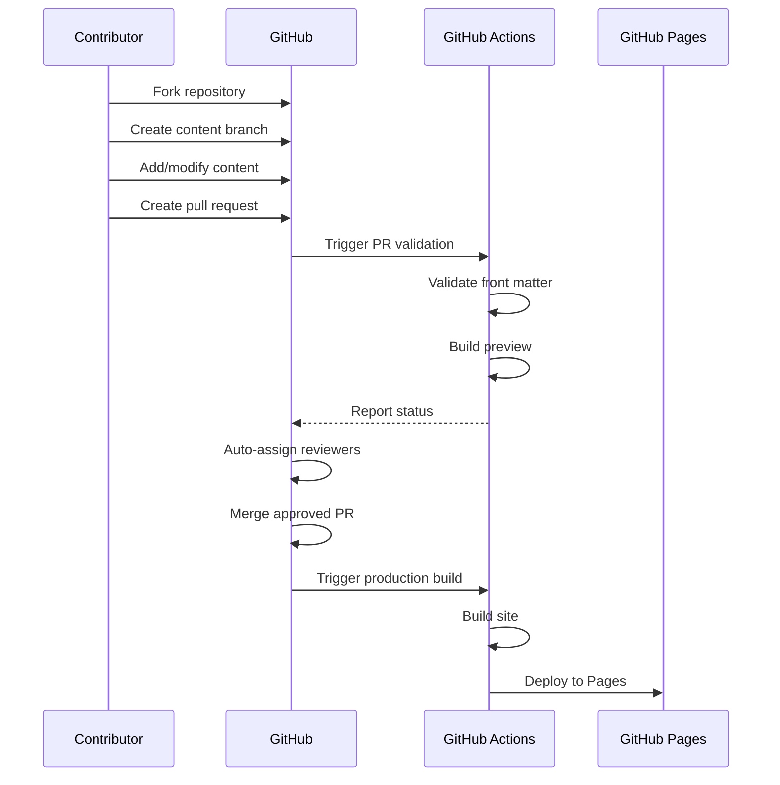

# Design Document

## Introduction

This document outlines the technical architecture and design decisions for the promptz.dev Hugo-based static website. The design focuses on performance, maintainability, and developer experience while supporting git-based content workflows and comprehensive content discovery.

## System Architecture



## Content Architecture

### Content Types and Organization

```
content/
├── prompts/
│   ├── _index.md
│   ├── architecture/
│   │   ├── _index.md
│   │   └── aws-architecture-diagram.md
│   ├── code-generation/
│   │   ├── _index.md
│   │   └── react-component-generator.md
│   └── testing/
│       ├── _index.md
│       └── unit-test-generator.md
├── rules/
│   ├── _index.md
│   ├── nextjs/
│   │   ├── _index.md
│   │   └── nextjs-best-practices.md
│   └── typescript/
│       ├── _index.md
│       └── typescript-standards.md
└── agents/
    ├── _index.md
    ├── code-review/
    │   ├── _index.md
    │   └── security-focused-reviewer.md
    └── documentation/
        ├── _index.md
        └── api-doc-generator.md
```

### Front Matter Schema

```yaml
---
title: "Content Title" # Required: Display name
description: "Brief description" # Required: SEO and overview
author: "github-username" # Required: Attribution
date: "2024-01-15" # Required: Creation date
lastmod: "2024-01-20" # Optional: Last modification
tags: ["tag1", "tag2", "tag3"] # Required: Minimum 1 tag
categories: ["category"] # Required: Content category
draft: false # Optional: Publication status
featured: false # Optional: Featured content
sourceURL: "https://github.com/repo" # Optional: Reference link
difficulty: "beginner" # Optional: beginner|intermediate|advanced
---
```

## Data Models



## Hugo Configuration Architecture

### Site Configuration Structure

```yaml
# hugo.yaml
baseURL: "https://promptz.dev"
languageCode: "en-us"
title: "Promptz - Ultimate Library for Amazon Q Developer"
theme: "promptz-theme"

params:
  description: "Discover, create, and perfect prompts for Amazon Q Developer"
  author: "Promptz Community"
  social:
    github: "https://github.com/cremich/promptz"

taxonomies:
  tag: "tags"
  category: "categories"
  author: "authors"

markup:
  goldmark:
    renderer:
      unsafe: true
  highlight:
    style: "github-dark"
    lineNos: true
    codeFences: true

outputs:
  home: ["HTML", "RSS", "JSON"]
  page: ["HTML"]
  section: ["HTML", "RSS"]
```

## Theme Architecture

### Layout Hierarchy

```
layouts/
├── _default/
│   ├── baseof.html          # Base template
│   ├── single.html          # Individual content pages
│   ├── list.html            # Content listing pages
│   └── index.html           # Homepage
├── partials/
│   ├── head.html            # HTML head section
│   ├── header.html          # Site navigation
│   ├── footer.html          # Site footer
│   ├── content-card.html    # Content preview cards
│   ├── search.html          # Search interface
│   └── related.html         # Related content
├── shortcodes/
│   ├── prompt-example.html  # Prompt display block
│   ├── code-copy.html       # Code with copy button
│   └── author-bio.html      # Author attribution
└── taxonomy/
    ├── tag.html             # Tag listing page
    ├── category.html        # Category listing page
    └── author.html          # Author profile page
```

## Design System

### Basecoat CSS Integration

The design system is built on **Basecoat CSS**, which brings the magic of Shadcn/ui components to Hugo without requiring React. Basecoat CSS provides a comprehensive component library built with Tailwind CSS that works with any web stack.

#### Key Benefits of Basecoat CSS:

- **Framework Agnostic**: Works with Hugo, Astro, Next.js, Nuxt.js, and any HTML-based framework
- **Shadcn/ui Compatible**: Provides the same design language and component patterns as Shadcn/ui
- **Tailwind CSS Based**: Built on top of Tailwind CSS for consistent styling and customization
- **Accessible**: Components follow WAI-ARIA design patterns for accessibility
- **No JavaScript Framework Required**: Pure HTML and CSS with optional JavaScript enhancements

#### Hugo Configuration for Basecoat CSS

Hugo provides native Tailwind CSS processing via the `css.TailwindCSS` function, which integrates seamlessly with Basecoat CSS.

```yaml
# hugo.yaml - Required configuration for Tailwind CSS + Basecoat CSS
[build]
  [build.buildStats]
    enable = true
  [[build.cachebusters]]
    source = 'assets/notwatching/hugo_stats\.json'
    target = 'css'
  [[build.cachebusters]]
    source = '(postcss|tailwind)\.config\.js'
    target = 'css'

[module]
  [[module.mounts]]
    source = 'assets'
    target = 'assets'
  [[module.mounts]]
    disableWatch = true
    source = 'hugo_stats.json'
    target = 'assets/notwatching/hugo_stats.json'
```

#### CSS Configuration

```css
/* assets/css/main.css */
@import "tailwindcss";
@import "basecoat-css";
@source "hugo_stats.json";

/* Basecoat CSS provides Shadcn-compatible CSS variables automatically */
/* Additional custom theme variables can be added here if needed */
```

#### Tailwind Configuration

```javascript
// tailwind.config.js
module.exports = {
  content: ["./layouts/**/*.html", "./content/**/*.md", "./hugo_stats.json"],
  darkMode: "class",
  theme: {
    extend: {
      // Basecoat CSS extends Tailwind with Shadcn-compatible colors
      // Additional customizations can be added here
    },
  },
};
```

#### Package Dependencies

```json
{
  "dependencies": {
    "basecoat-css": "^0.3.2"
  },
  "devDependencies": {
    "tailwindcss": "^4.0.0"
  }
}
```

### CSS Processing Template

```html
<!-- layouts/partials/head/css.html -->
{{ with resources.Get "css/main.css" }} {{ $opts := dict "minify" (not
hugo.IsDevelopment) }} {{ with . | css.TailwindCSS $opts }} {{ if
hugo.IsDevelopment }}
<link rel="stylesheet" href="{{ .RelPermalink }}" />
{{ else }} {{ with . | fingerprint }}
<link
  rel="stylesheet"
  href="{{ .RelPermalink }}"
  integrity="{{ .Data.Integrity }}"
  crossorigin="anonymous"
/>
{{ end }} {{ end }} {{ end }} {{ end }}
```

```html
<!-- layouts/_default/baseof.html -->
<head>
  <!-- Other head elements -->
  {{ with (templates.Defer (dict "key" "global")) }} {{ partial "head/css.html"
  . }} {{ end }}
</head>
```

### Component Design Patterns

```html
<!-- Content Card Component using Basecoat CSS -->
<div class="card">
  <div class="card-header">
    <div class="flex items-start justify-between">
      <h3 class="text-xl font-semibold">{{ .Title }}</h3>
      <span class="text-sm text-muted-foreground"
        >{{ .Params.difficulty }}</span
      >
    </div>
  </div>
  <div class="card-content">
    <p class="text-muted-foreground mb-4">{{ .Description }}</p>
    <div class="flex flex-wrap gap-2 mb-4">
      {{ range .Params.tags }}
      <span
        class="inline-flex items-center rounded-md bg-primary/10 px-2 py-1 text-xs font-medium text-primary ring-1 ring-inset ring-primary/20"
      >
        #{{ . }}
      </span>
      {{ end }}
    </div>
  </div>
  <div class="card-footer">
    <div
      class="flex items-center justify-between text-sm text-muted-foreground"
    >
      <span>by {{ .Params.author }}</span>
      <time>{{ .Date.Format "Jan 2, 2006" }}</time>
    </div>
  </div>
</div>

<!-- Button Components using Basecoat CSS -->
<button class="btn btn-primary">Primary Action</button>
<button class="btn btn-outline">Secondary Action</button>
<button class="btn btn-ghost">Tertiary Action</button>

<!-- Form Components using Basecoat CSS -->
<form class="form grid gap-6">
  <div class="grid gap-2">
    <label for="search-input">Search</label>
    <input
      type="search"
      id="search-input"
      placeholder="Search prompts, rules, and agents..."
    />
    <p class="text-muted-foreground text-sm">
      Find content across all categories
    </p>
  </div>
  <button type="submit" class="btn btn-primary">Search</button>
</form>

<!-- Alert Component using Basecoat CSS -->
<div class="alert alert-success">
  <span class="alert-icon">✓</span>
  <h3 class="alert-title">Success!</h3>
  <p class="alert-description">Your content has been published successfully.</p>
</div>
```

## Search Architecture

### Pagefind Integration



### Search Implementation

```javascript
// Search functionality aligned with Pagefind API
class SearchInterface {
  constructor() {
    this.searchInput = document.getElementById("search-input");
    this.searchResults = document.getElementById("search-results");
    this.pagefind = null;
  }

  async initialize() {
    // Import Pagefind - init() is called automatically on first search
    this.pagefind = await import("/pagefind/pagefind.js");
    this.setupEventListeners();
    this.handleURLParams();
  }

  setupEventListeners() {
    // Use Pagefind's built-in debounced search
    this.searchInput.addEventListener("input", this.handleInput.bind(this));
    this.searchInput.addEventListener("keypress", this.handleEnter.bind(this));
  }

  async handleInput(event) {
    const query = event.target.value;
    if (query.length < 2) {
      this.clearResults();
      return;
    }

    // Preload indexes while user types for better performance
    this.pagefind.preload(query);

    // Use built-in debounced search (300ms default)
    const search = await this.pagefind.debouncedSearch(query);
    await this.displayResults(search, query);
    this.updateURL(query);
  }

  async displayResults(search, query) {
    // Load first 10 results concurrently for better performance
    const resultsToShow = search.results.slice(0, 10);
    const loadedResults = await Promise.all(
      resultsToShow.map((result) => result.data()),
    );

    this.renderResults(loadedResults, query);
  }

  renderResults(results, query) {
    const html = results
      .map(
        (result) => `
      <article class="bg-gray-800 rounded-lg p-6 border border-gray-700 hover:border-primary-500 transition-colors">
        <h3 class="text-xl font-semibold text-white mb-2">
          <a href="${result.url}" class="hover:text-primary-400">
            ${this.highlightText(result.meta.title, query)}
          </a>
        </h3>
        <p class="text-gray-300 mb-4">
          ${this.highlightText(result.excerpt, query)}
        </p>
        <div class="flex items-center justify-between text-sm text-gray-400">
          <span>${result.meta.author || "Unknown"}</span>
          <span>${new Date(result.meta.date).toLocaleDateString()}</span>
        </div>
      </article>
    `,
      )
      .join("");

    this.searchResults.innerHTML = html;
  }

  highlightText(text, query) {
    if (!text || !query) return text;
    const regex = new RegExp(`(${query})`, "gi");
    return text.replace(
      regex,
      '<mark class="bg-primary-500/30 text-primary-200">$1</mark>',
    );
  }

  updateURL(query) {
    const url = new URL(window.location);
    if (query) {
      url.searchParams.set("query", query);
    } else {
      url.searchParams.delete("query");
    }
    window.history.pushState({}, "", url);
  }

  handleURLParams() {
    const urlParams = new URLSearchParams(window.location.search);
    const query = urlParams.get("query");
    if (query) {
      this.searchInput.value = query;
      this.handleInput({ target: { value: query } });
    }
  }

  clearResults() {
    this.searchResults.innerHTML = "";
    this.updateURL("");
  }
}

// Initialize search when DOM is ready
document.addEventListener("DOMContentLoaded", () => {
  const search = new SearchInterface();
  search.initialize();
});
```

### Pagefind Configuration

```javascript
// Configure Pagefind options
const pagefind = await import("/pagefind/pagefind.js");
await pagefind.options({
  baseUrl: "/",
  excerptLength: 30,
  highlightParam: "highlight", // Adds ?highlight=query to result URLs
});
```

### Build Integration

```yaml
# GitHub Actions build step
- name: Build search index
  run: npm run build:search
```

### Hugo Template Integration

```html
<!-- layouts/partials/search.html -->
<div class="search-container">
  <div class="relative">
    <input
      type="search"
      id="search-input"
      placeholder="Search prompts, rules, and agents..."
      class="w-full px-4 py-2 bg-gray-800 border border-gray-700 rounded-lg text-white placeholder-gray-400 focus:border-primary-500 focus:ring-1 focus:ring-primary-500"
    />
    <svg
      class="absolute right-3 top-2.5 h-5 w-5 text-gray-400"
      fill="none"
      stroke="currentColor"
      viewBox="0 0 24 24"
    >
      <path
        stroke-linecap="round"
        stroke-linejoin="round"
        stroke-width="2"
        d="M21 21l-6-6m2-5a7 7 0 11-14 0 7 7 0 0114 0z"
      ></path>
    </svg>
  </div>

  <div id="search-results" class="mt-6 space-y-4">
    <!-- Results populated by JavaScript -->
  </div>

  <div id="search-empty" class="hidden text-center py-12">
    <p class="text-gray-400">No results found. Try different keywords.</p>
  </div>
</div>

<!-- Include search script -->
<script src="/js/search.js"></script>
```

## SEO and Performance Architecture

### OpenGraph Image Generation



### Performance Optimization Strategy

1. **Asset Optimization**
   - Hugo Pipes for CSS/JS bundling and minification
   - Image processing with WebP conversion
   - Critical CSS inlining

2. **Caching Strategy**
   - Static asset versioning with Hugo fingerprinting
   - Service worker for offline capability
   - CDN-friendly cache headers

3. **Core Web Vitals Targets**
   - LCP < 2.5s through optimized images and critical CSS
   - FID < 100ms with minimal JavaScript
   - CLS < 0.1 through proper image sizing and layout

## GitHub Integration Architecture

### Content Workflow



### Validation Pipeline

```yaml
# .github/workflows/validate-content.yml
name: Validate Content
on:
  pull_request:
    paths: ["content/**/*.md"]

jobs:
  validate:
    runs-on: ubuntu-latest
    steps:
      - uses: actions/checkout@v4
      - name: Setup Node.js
        uses: actions/setup-node@v4
        with:
          node-version: "18"
      - name: Install dependencies
        run: npm ci
      - name: Validate Front Matter
        run: npm run validate
      - name: Check Content Quality
        run: npm run lint:content
```

## Deployment Architecture

### Build and Deploy Pipeline

```yaml
# .github/workflows/deploy.yml
name: Deploy to GitHub Pages
on:
  push:
    branches: [main]

jobs:
  deploy:
    runs-on: ubuntu-latest
    steps:
      - uses: actions/checkout@v4
      - name: Setup Node.js
        uses: actions/setup-node@v4
        with:
          node-version: "18"
      - name: Setup Hugo
        uses: peaceiris/actions-hugo@v2
        with:
          hugo-version: "latest"
          extended: true
      - name: Install dependencies
        run: npm ci
      - name: Build site
        run: npm run build
      - name: Deploy to GitHub Pages
        uses: peaceiris/actions-gh-pages@v3
        with:
          github_token: ${{ secrets.GITHUB_TOKEN }}
          publish_dir: ./public
          custom_domain: promptz.dev
```

### NPM Scripts Configuration

```json
{
  "scripts": {
    "dev": "hugo server --buildDrafts --buildFuture --disableFastRender",
    "build": "hugo --minify && npm run build:search",
    "build:search": "pagefind --source public --bundle-dir pagefind",
    "validate": "hugo --buildDrafts --buildFuture --quiet",
    "lint:content": "node scripts/validate-content.js",
    "preview": "npm run build && hugo server --source public"
  },
  "devDependencies": {
    "tailwindcss": "^4.0.0",
    "@tailwindcss/cli": "^4.0.0",
    "pagefind": "^1.0.0"
  }
}
```

## Security Considerations

1. **Content Security**
   - Front matter validation prevents malicious metadata
   - Markdown sanitization through Hugo's safe rendering
   - Author verification through GitHub integration

2. **Build Security**
   - Dependabot for dependency updates
   - Security scanning in GitHub Actions
   - Minimal attack surface with static site

3. **Access Control**
   - GitHub repository permissions for content management
   - Branch protection rules for main branch
   - Required reviews for content changes
