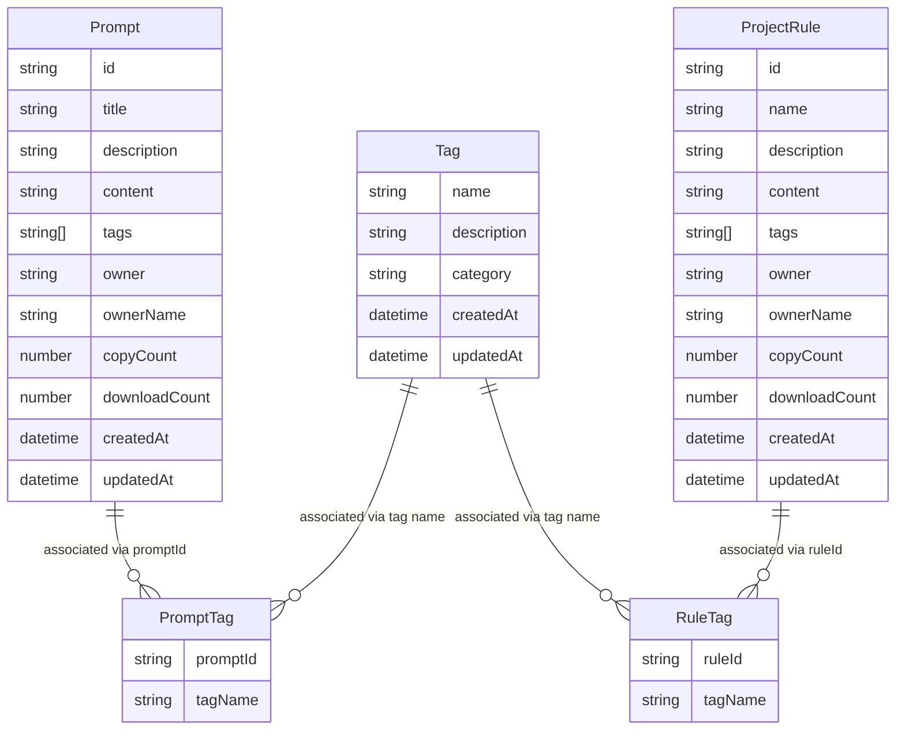
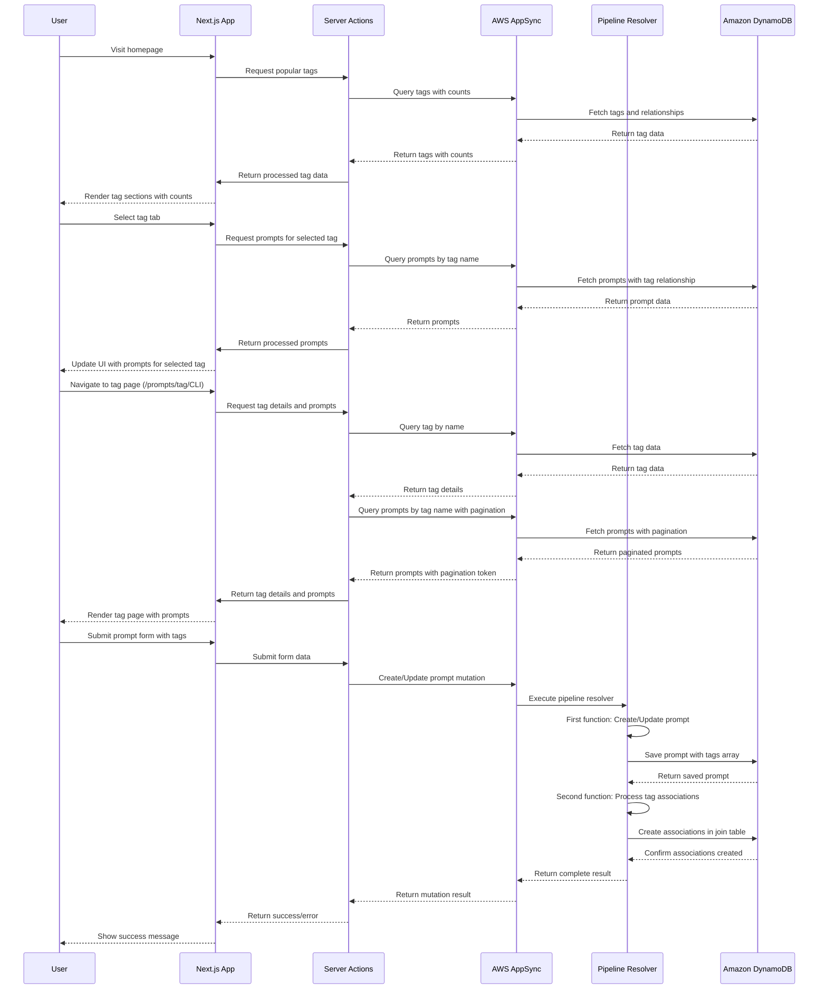

# Technical Specification: Tag Management

## 1. Summary

This feature enhances the discoverability of prompts and project rules by implementing a robust tag-based retrieval system. Currently, Promptz uses a static list of tags with limited query capabilities, hampering user experience and integration with external clients like the MCP server. The enhancement will introduce dedicated tag-based browsing sections on the homepage, virtual routes for SEO optimization, and an efficient API for tag-based queries, significantly improving content discovery.

## 2. Goals

**Goals:**

- Create a dedicated data model for tags with many-to-many relationships to prompts and project rules
- Implement API endpoints for querying tags and associated content
- Add "Prompts per Tag" and "Project Rules per Tag" sections to the homepage
- Create virtual routes for each tag to improve SEO (e.g., `/prompts/tag/CLI`)
- Ensure backward compatibility with existing tag implementation

**Non-Goals:**

- Redesigning the overall tagging system architecture
- Implementing a tag suggestion system
- Adding user-defined custom tags (tags remain predefined)
- Changing the visual design of prompt and project rule cards

## 4. User Stories / Use Cases

1. **As a developer**, I want to quickly browse prompts by tag on the homepage, so that I can find relevant prompts without navigating to the browse section.

2. **As a developer**, I want to quickly browse project rules by tag on the homepage, so that I can find relevant project rules without navigating to the browse section.

3. **As a developer**, I want to access a dedicated page for each tag (e.g., `/prompts/tag/CLI`), so that I can bookmark or share specific tag collections.

4. **As a content creator**, I want my tagged prompts to be more discoverable, so that more users can benefit from my contributions.

5. **As a platform administrator**, I want to maintain backward compatibility with existing tag implementations, so that existing data remains valid.

## 5. Functional Requirements

1. **Tag Data Model:**

   - Create a new Tag model in the Amplify data schema
   - Establish many-to-many relationships between Tags and Prompts
   - Establish many-to-many relationships between Tags and Project Rules
   - Use tag names as identifier to ensure backward compatibility

2. **Data Migration:**

   - Implement a migration script to convert existing tag attributes to relationships in the join table
   - Ensure no data loss during migration
   - Validate migration success with data integrity checks

3. **API Functionality:**

   - The basic API functionality is automatically provided by Amplify once the data model is defined.
   - Implement data fetching to list all available tags
   - Implement data fetching to get prompts by tag name
   - Implement data fetching to get project rules by tag name
   - Disable mutations and subscriptions for the Tag model

4. **UI Components:**

   - Add "Prompts per Tag" section to the homepage with tab navigation
   - Add "Project Rules per Tag" section to the homepage with tab navigation
   - Reuse existing PromptCard and ProjectRule components for rendering
   - Update tag-based filtering on the browse page using new data fetching methods to get prompts and project rules by tag name

5. **Routing:**

   - Create virtual routes for each tag (e.g., `/prompts/tag/CLI`, `/rules/tag/react`)
   - Add tag routes to the sitemap for SEO optimization

## 6. Non-functional Requirements

1. **Performance:**

   - Tag-based queries should complete within 300ms
   - Homepage with tag sections should load within 1.5 seconds

2. **Security:**

   - Maintain existing authorization rules for prompts and project rules
   - Disable mutations and subscriptions for the Tag model
   - Tag-related queries must be accessible via public api key.

3. **Accessibility:**

   - Tab navigation must be keyboard accessible
   - Tag sections must have proper ARIA labels
   - Color contrast must meet WCAG AA standards

4. **SEO:**

   - Tag pages must have proper meta tags
   - Tag pages must be included in the sitemap
   - Implement structured data for tag pages

5. **Backward Compatibility:**
   - Existing code referencing tags must continue to work
   - Migration must not disrupt existing functionality

## 7. Solution Design

### Overview

The solution introduces a new Tag data model with many-to-many relationships to Prompts and Project Rules, while maintaining backward compatibility with the existing tag implementation. The architecture follows these key principles:

1. **Data Model Enhancement**:

   - A dedicated Tag model will be created to represent tags as first-class entities
   - Many-to-many relationships will be established using a multiple join tables (PromptTag and RuleTag)
   - Tag names will be used as identifier to ensure backward compatibility with existing code

2. **Data Access Patterns**:

   - The solution will support efficient querying of tags and their associated content
   - Existing tag arrays will be maintained for backward compatibility
   - New relationships will enable more sophisticated queries and filtering
   - The savePrompt and saveProjectRule mutation will be updated to a pipeline resolver with a new handler being called after the existing handler to save the relations of linked tags in the join table.

3. **UI Integration**:

   - Homepage will feature new sections for browsing by tag
   - Tab navigation will allow users to quickly switch between tags
   - Existing components will be reused for consistent presentation

4. **Routing Strategy**:
   - Virtual routes will be created for each tag
   - Server-side rendering will be used for optimal SEO
   - Sitemap will be updated to include tag-specific routes

### Data Model

The diagram illustrates the entity relationships in our data model:

- **Tag**: Represents a tag entity with a unique tag name, description, category and creation/update timestamps.
- **Prompt**: Existing prompt model that maintains the original tags array for backward compatibility.
- **ProjectRule**: Existing project rule model that maintains the original tags array for backward compatibility.
- **PromptTag** and **RuleTag**: Join table that establishes the many-to-many relationship between Tags and Prompts as well as Tags and ProjectRules.

This design allows us to:

1. Maintain backward compatibility with existing tag arrays
2. Enable efficient querying of prompts and project rules by tag
3. Support counting of prompts and project rules per tag
4. Facilitate future tag-based features

### Data Flow

The sequence diagram above illustrates key data flows:

1. **Homepage Tag Section Flow**: When a user visits the homepage, the system fetches popular tags with their associated prompt/rule counts and displays them in the tag sections.

2. **Tag Tab Selection Flow**: When a user selects a specific tag tab on the homepage, the system fetches and displays prompts or project rules associated with that tag.

3. **Tag Page Navigation Flow**: When a user navigates to a dedicated tag page (e.g., `/prompts/tag/CLI`), the system fetches detailed information about the tag and all associated prompts with pagination support.

4. **Prompt Creation Flow with Tag Associations**: When a user creates or updates a prompt with tags, a pipeline resolver processes the operation in two steps:
   - First, it creates or updates the prompt record with the standard tags array (for backward compatibility)
   - Then, it establishes the relationships in the join table

The Project Rule creation flow follows a similar pattern to the Prompt creation flow, using the same pipeline resolver approach to maintain both the traditional tags array and the new relational structure.

This pipeline resolver approach ensures that:

- Backward compatibility is maintained with the existing tags array
- New tag relationships are properly established for enhanced querying
- The process is atomic, with both operations succeeding or failing together
- Data consistency is maintained between the tags array and the relational structure

### Migration Strategy

The migration strategy involves:

1. Creating the new Tag model and relationship tables
2. Running a migration script that:
   - Creates Tag entities for all existing unique tags based on the enumerations defined in the tag-model.ts
   - Establishes relationships between prompts/rules and their tags
   - Validates data integrity after migration
3. Maintaining backward compatibility by preserving existing tag arrays

## 8. Dependencies and Constraints

### Dependencies

1. **Technical Dependencies:**

   - AWS Amplify Gen 2 for backend services
   - Next.js 15.3.1 for frontend framework
   - AppSync for GraphQL API
   - DynamoDB for data storage
   - React 19.1.0 for UI components

2. **Team Dependencies:**
   - Backend developer to implement data model changes
   - Frontend developer to implement UI components
   - DevOps engineer to handle migration script execution

### Constraints

1. **Technical Constraints:**

   - Must maintain backward compatibility with existing tag implementation
   - Must disable mutations and subscriptions for the Tag model
   - Must use tag names as identifier for backward compatibility

2. **Business Constraints:**
   - Tags remain predefined (no user-defined tags)
   - Migration must be performed with minimal disruption to users

## 9. Risks and Mitigations

| Risk                                         | Impact | Likelihood | Mitigation                                                                                  |
| -------------------------------------------- | ------ | ---------- | ------------------------------------------------------------------------------------------- |
| Data migration errors                        | High   | Medium     | Create comprehensive test plan, run migration in staging first, implement rollback strategy |
| Performance degradation with complex queries | Medium | Low        | Implement pagination, optimize queries, monitor performance metrics                         |
| Backward compatibility issues                | High   | Low        | Maintain existing tag arrays alongside new relationships, comprehensive testing             |
| SEO impact during transition                 | Medium | Low        | Implement proper redirects, update sitemap promptly, monitor search console                 |
| MCP server integration challenges            | Medium | Medium     | Develop and test MCP server changes in parallel, create fallback mechanisms                 |

## 10. Testing & Acceptance Criteria

### Testing Plan

1. **Unit Tests:**

   - Test UI components for tag sections

2. **End-to-End Tests:**
   - Test complete user journeys for browsing by tag
   - Test user journey to create a prompt with tags associated
   - Test user journey to create a project rule with tags associated
   - Test tag page navigation and rendering
   - Test migration script functions

### Acceptance Criteria

1. **Tag Data Model:**

   - ✅ Tag model is created with proper relationships
   - ✅ Existing prompts and project rules are associated with tags
   - ✅ Queries return expected results
   - ✅ Prompts can be created with associated tags
   - ✅ Project rules can be created with associated tags

2. **Homepage Tag Sections:**

   - ✅ "Prompts per Tag" section displays on homepage
   - ✅ "Project Rules per Tag" section displays on homepage
   - ✅ Tab navigation works correctly
   - ✅ Prompts and project rules display correctly for each tag

3. **Tag Pages:**

   - ✅ Tag-specific pages (e.g., `/prompts/tag/CLI`) render correctly
   - ✅ Pages include proper metadata for SEO
   - ✅ Pages are included in the sitemap

4. **Migration:**
   - ✅ All existing tagged content is properly migrated
   - ✅ No data loss during migration
   - ✅ Backward compatibility is maintained

## 11. Impact Assessment

### User Impact

- **Positive Impact:**

  - Improved discoverability of prompts and project rules
  - Faster access to relevant content through homepage tag sections
  - Better SEO for tag-specific content
  - Enhanced MCP server integration for AI-assisted discovery

- **Potential Negative Impact:**
  - Brief learning curve for users accustomed to the current browsing pattern
  - Temporary performance impact during migration

### Cost/Benefit Analysis

- **Costs:**

  - Reduced data transfer and query processing costs expected due to efficient data fetching

- **Benefits:**
  - Significantly improved user experience
  - Better content discoverability
  - Enhanced MCP server integration
  - Improved SEO and organic traffic
  - Foundation for future tag-based features

## 12. Open Questions

1. **Tag Governance:**

   - Who will be responsible for managing the predefined tag list?
   - What is the process for adding or removing tags?

2. **Analytics:**

   - Should we track which tags are most popular?
   - How will we measure the success of this feature?

3. **Future Enhancements:**

   - Should we consider implementing tag suggestions based on prompt content?
   - Should we allow users to filter by multiple tags simultaneously?

4. **Migration Timing:**

   - What is the best time to run the migration to minimize user impact?
   - Should we implement a phased rollout or a single migration?

5. **Performance Optimization:**
   - How should we handle pagination for tags with many associated prompts?
   - Should we implement caching for frequently accessed tags?
